# INFORME-LABORATORIO-1
1) OBJETIVOS

Objetivo General: 

-Explicar y demostrar experimentalmente la Ley de Kirchhoff de Voltajes y la Ley de Kirchhoff de Corrientes.

Objetivos Especificos:

-Calcular los voltajes de cada resistencia puestas en el protoboard.
-Realizar correctamente la medicion de voltajes, corriente y resistencia.
-Comnparar los valores medidos con los calculados.

2) Marco Teórico

Las leyes de Kirchhoff junto con la de Ohm son aquellas que nos permiten resolver un circuito o calcular los valores de los elementos o magnitudes que lo conforman, estas leyes tienen como respaldo al principio de conservación de la energía eléctrica y conservación de energía.
Los conceptos básicos que se ven cuando hablamos de circuitos eléctricos y su análisis, son la de nodo que es un punto donde se divide a mas corrientes, la de rama que es todo componente de circuito eléctrico que se extiende entre dos nodos y por ultimo la malla que es todo camino cerrado dentro de una red eléctrica.

La primera ley de Kirchhoff o también llamado ley de los nodos o de las corrientes, la cual dice que en un nodo donde entra energía con varios elementos, a medida que la carga debe conservarse que la carga por unidad de tiempo, que llega a el debe ser igual a la carga por unidad de tiempo que sale del mismo nodo.
Por ejemplo, si un circuito tenemos un nodo donde entran 4 elementos y sale uno, sus respectivos signos serian los que entrar positivos y negativos si salen, en este caso se restaría a la sumatoria de corrientes que entran al nodo. Para resumir sus características son:

•	La suma algebraica de corrientes de una rama que entran a un nodo es cero, en cualquier instante de tiempo/
•	La suma algebraica de corrientes de rama que salen a un nodo es cero, en cualquier instante de tiempo. (Se desprecia el hecho de no tener fuentes ideales de corriente)

La segunda ley de Kirchhoff o también se la denomina ley de mallas o de tensiones, estas están asociada con la conservación de la energía por lo que cumplirá con la suma de todas las diferencias de potencial, debe ser nula. Se debe definir un sentido de giro para así considerar positiva a la tensión del componente, si con el recorrido elegido, pasamos de un potencial mas bajo a otro mas elevado. La consideraremos negativa si se da el caso contrario. Para ser mas concretos en las características de le ley de voltajes, esta son las siguientes:

•	La suma algebraica de caídas de voltaje alrededor de un camino cerrado es cero, en cualquier instante de tiempo.
•	Para cualquier par de nodos, la caída de voltaje es V=Vi-Vk, teniendo en cuenta que los nodos se llaman i e k, Donde Vi es el voltaje de nodo del nodo j respecto a la referencia, y Vk es el voltaje de nodo del nodo k respecto a la referencia.
•	Para un circuito conectado a una secuencia de nodos A-B-C-D la caída de voltaje en cualquier instante de tiempo es: VAD=VAB+VCD.
•	Para un circuito la suma de voltajes nodo a nodo para una secuencia de nodos cerrada es cero.

3) Explicación del procedimiento.

El circuito se forma de cinco resistencias que en su total son 4,8674 [KΩ] y una fuente de 10 [v], de manera que las resistencias y el circuito se encuentra en organización mixta ya que está organizado en serie y paralelo. La corriente pasara por R1 y después se divide para R2, R3 y R4 porque esta en paralelo y la corriente se divide y el voltaje se mantiene; y por último pasara por la R5 para después cerrar el circuito. El voltaje de la resistencia R2 va ser la misma para la suma de resistencias entre R3 y R4 ya que se encuentran en paralelo a R2, La intensidad eléctrica de todo el circuito va ser expresada en mA porque es directamente proporcional al voltaje y en su total va ser de 2,05x10^-3 [A].

Los nodos del circuito nos ayudan a ver el cambio de estructura de estos, por lo que primero  se identifica dónde están los nodos de conexión para saber si es serie o paralelo, en este caso podemos observar dos nodos de conexión, uno de entrada y otro de salida de una estructura en paralelo con estructura en serie dentro de R3 y R4, La trayectoria del circuito, está formada por tres de estas, ya que la primera esta entre R1, R2 y R5, la otra se encuentra en R1, R3, R4 y R5, y la tercera trayectoria es la que pasará por R3, R4 y R2.

PROCEDIMIENTO:

1. Arme el circuito que se muestra.

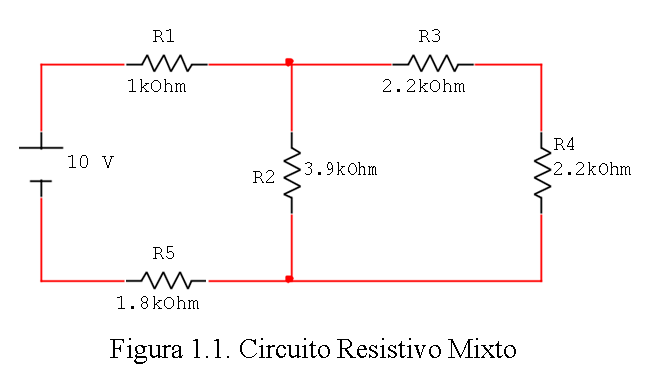

2. Mida el voltaje y corriente en cada uno de los elementos del circuito. Anote los resultados de las mediciones en la tabla.

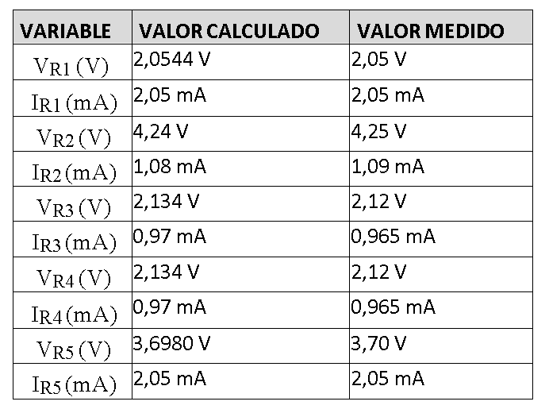

Se utilizo un simulador para la medicion de las magnitudes de los elementos que se encuentra en el circuito guía del inicio.

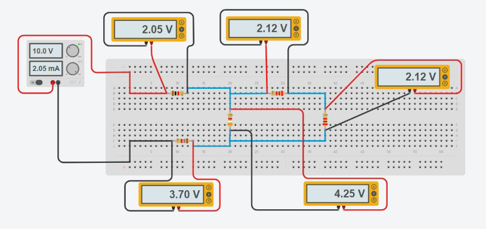

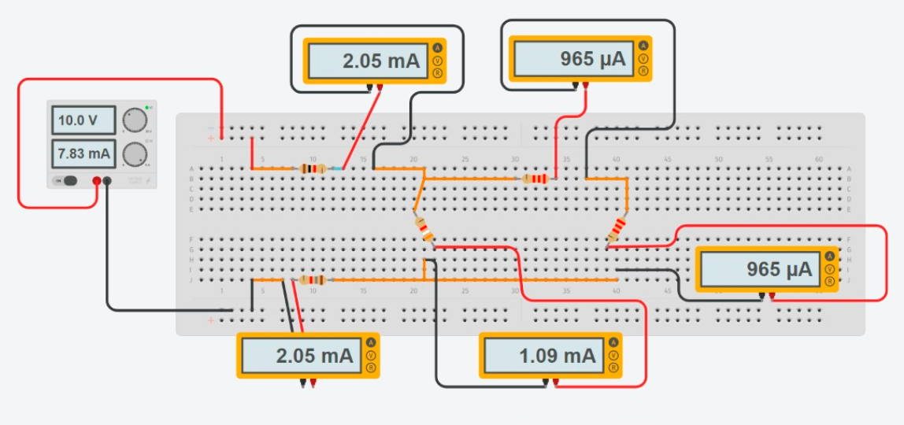

3. Verifique si se cumple la ley de kirchhoff de voltajes en cada trayectoria.

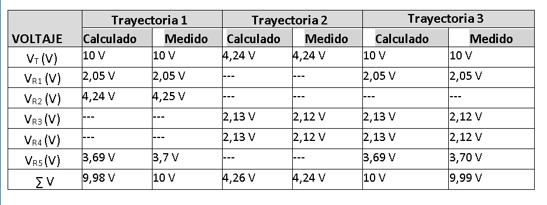

TRAYECTORIA 1

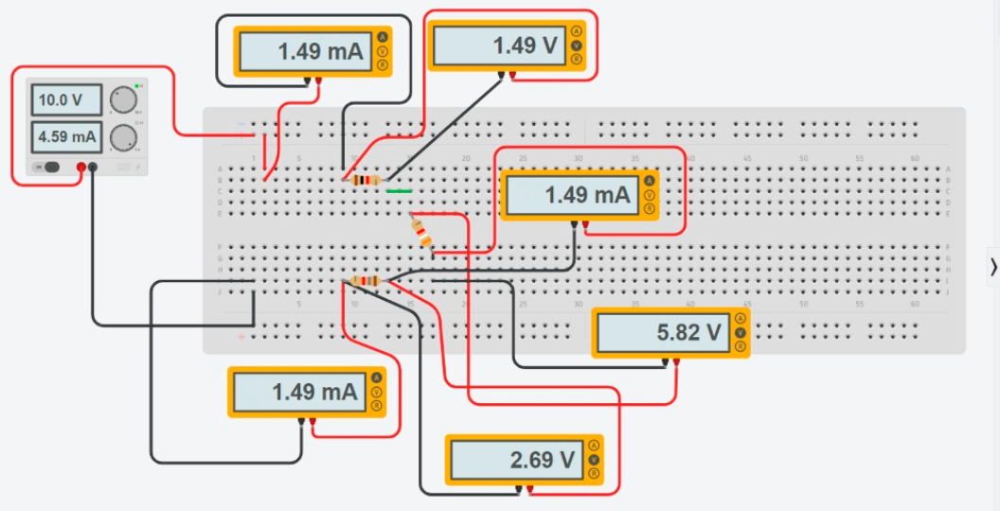

TRAYECTORIA 2

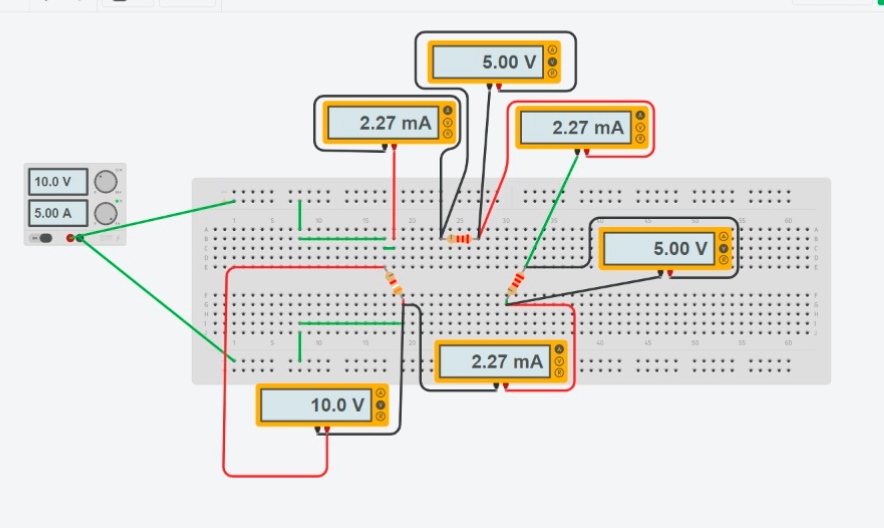

TRAYECTORIA 3

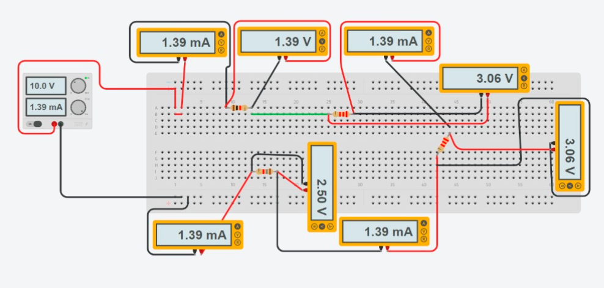

4. 1.5.4.	Verifique si se cumple la Ley de Kirchhoff de Corrientes en cada nodo, tomando con signo positivo las corrientes que entran al nodo y con signo negativo las que salen del nodo. Anote los resultados en la tabla.

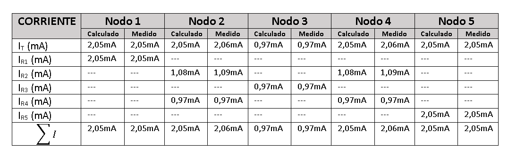

4) Calculo de error.

Se comprobo que los valores medidos no son tan exactos como los valores calculados por el hecho de que las fuentes o elementos electronicos no tienen valores exactos porque oscilan o tienen una tolerancia. La primera tabla es del valor de voltaje e intensidad de cada resistencia, estas varian un poco sus decimales teniendo asi valores mas aproxiamdos a los reales, la comprobacion que se hace es que la suma de todos los voltajes de las resistencias daran el voltaje total de la fuente o la que transcurre en el circuito, y de igual manera con la intensidad.

Tambien se comprobo que tienen tres tratectorias  las cuales la suma algebraica de sus voltajes, nos darán el voltaje total de la fuente. Tambien tenemos a los nodos, en este caso son 5, la comparacion de los valores calculados y medidos como antes dicho esto no varia por mucho solo por decimas.

El caluclo de error

Calculo de error de la tabla 1.

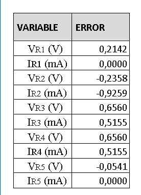

Calculo de error de la tabla 2.

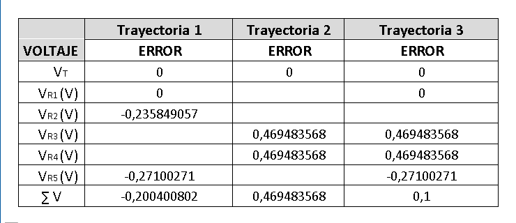

Calculo de error de la tabla 3.

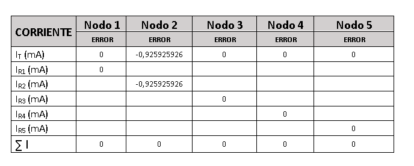

5) Video

https://youtu.be/zR2iE3-qWEo

6) Conclusiones

-El calculo de las magnitudes puede ser mas acertada al valor real de los elementos electricos, los cuales se da un valor aproximado o con una tolerancia, por el hecho de que no existen elementos electronicos con valores exactos.

-Logramos diseñar un circuito básico con la ayuda del simulador virtual asemejándose a la realidad, esto se logró realizar gracias a los conocimientos adquiridos en hira de clases además, llegamos que saber las diferencias de un circuito en serie y paralelo.

-Se realizaron correctamente las mediciones de voltaje, corriente y resistencia en el circuito, así se pudo comprobar las dos leyes de Kirchoff

7) Bibliografia

(Salazar, 2010)Arturo.J. (2014). Leyes de Kirchhoff Son dos y junto con la ley de Ohm, definen el conjunto de ecuaciones que permiten resolver un circuito eléctrico más o menos complejo. Ambas leyes se basan en principios superiores como el. 1–3.

Salazar, A. (2010). Leyes de voltajes y corrientes de Kirchhoff. Universidad de Los Andes, 1(1), 13–34.

